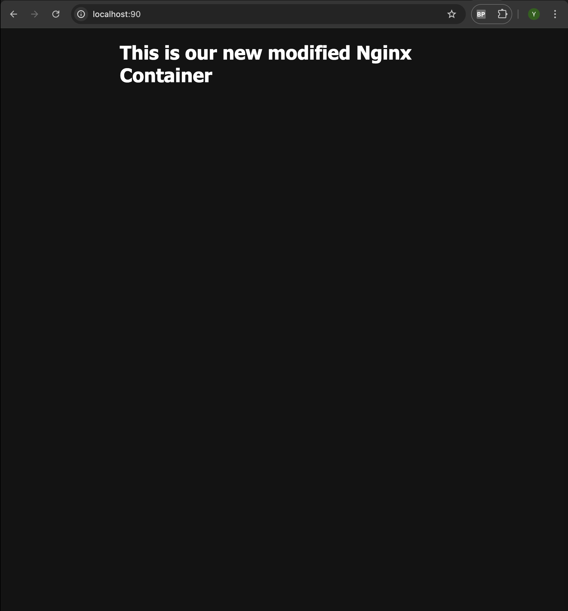
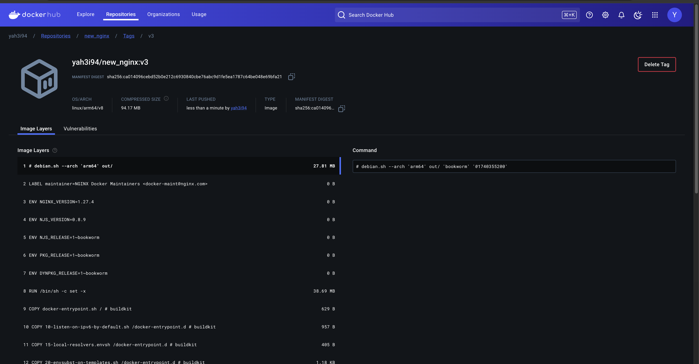

# 🐳 Building an Image from a Container & Pushing to Docker Hub 🚀

## 📖 Overview

In this guide, we’ll learn how to **create an image from a running container**, **push it to Docker Hub**, and **run a new container using that image**. This is useful for **saving custom modifications** and **sharing your work** with others.

---

## 🔥 **Step 1: Create an Image from a Running Container**

After modifying an existing **Nginx container**, we can **save those changes** as a new Docker image.

### **1️⃣ Commit the Running Container**

To create an image from a running container, use:

```plaintext
docker commit <container_name>
```

This saves the **current state** of the container as a new image.

### **2️⃣ Tag the Image**

Now, we tag our new image with a recognizable name:

```plaintext
docker tag <image-id> new_nginx
```

✅ Now, we have a **customized Nginx image** called `new_nginx`.

### **3️⃣ Run a New Container Using This Image**

To verify our new image, we can run a container from it:

```plaintext
docker run -dp 90:80 --name web new_nginx
```

Now, accessing `http://localhost:90` should display the modified Nginx page.



---

## 🔗 **Step 2: Push the Image to Docker Hub**

### **1️⃣ Create a Repository on Docker Hub**

- Go to [Docker Hub](https://hub.docker.com/) and create a new repository.
- Name it something like `new_nginx`.

### **2️⃣ Tag the Image for Docker Hub**

To push an image, it must be tagged with your **Docker Hub username and repository name**:

```plaintext
docker tag new_nginx <your-dockerhub-username>/new_nginx:v3
```

### **3️⃣ Push the Image to Docker Hub**

Now, push the tagged image to Docker Hub:

```plaintext
docker push <your-dockerhub-username>/new_nginx:v3
```

Once the push is complete, the image will be available on your Docker Hub repository.



---

## 🚀 **Step 3: Run a Container from Docker Hub**

Now that our image is on Docker Hub, we can pull and run it from **any machine**:

```plaintext
docker run -dp 90:80 <your-dockerhub-username>/new_nginx:v3
```

This will **download the image** from Docker Hub (if not already present) and run it.

Now, accessing `http://localhost:90` should display our **customized Nginx page**. 🎉

---

## 🎯 **Key Takeaways**

✅ **Docker commit** allows us to save a container’s modifications as an image.  
✅ **Tagging & pushing** the image makes it available on Docker Hub.  
✅ **Running the image from Docker Hub** lets us share it across multiple systems.

This process is great for **customized setups, backups, and collaboration**! 🚀🐳
