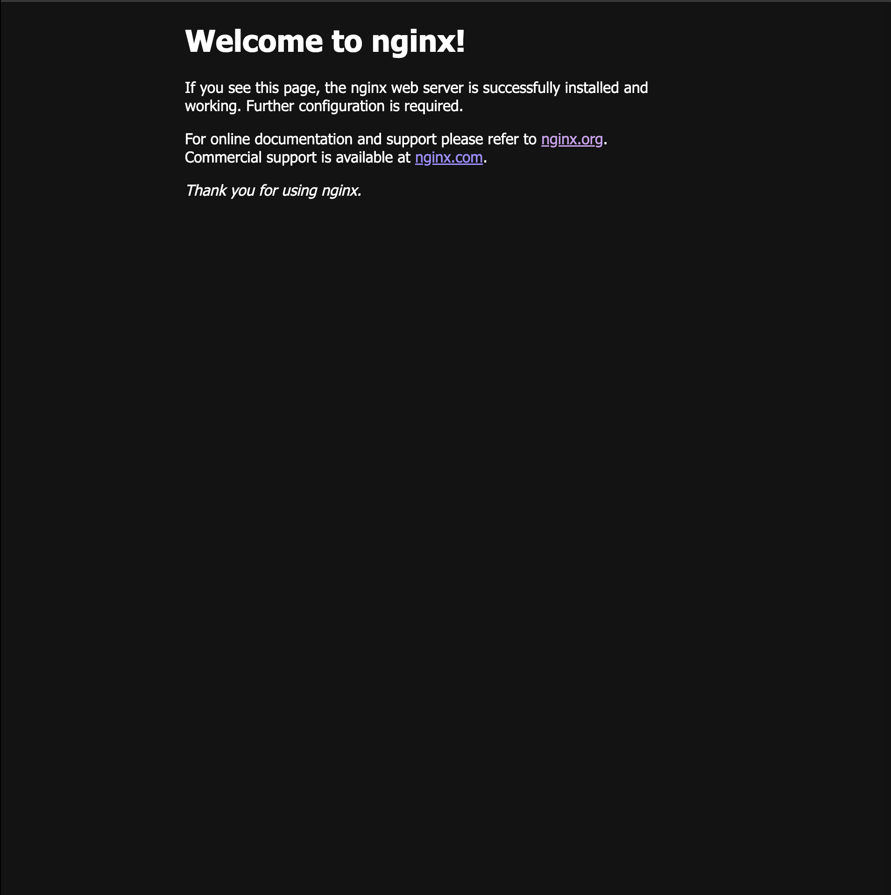
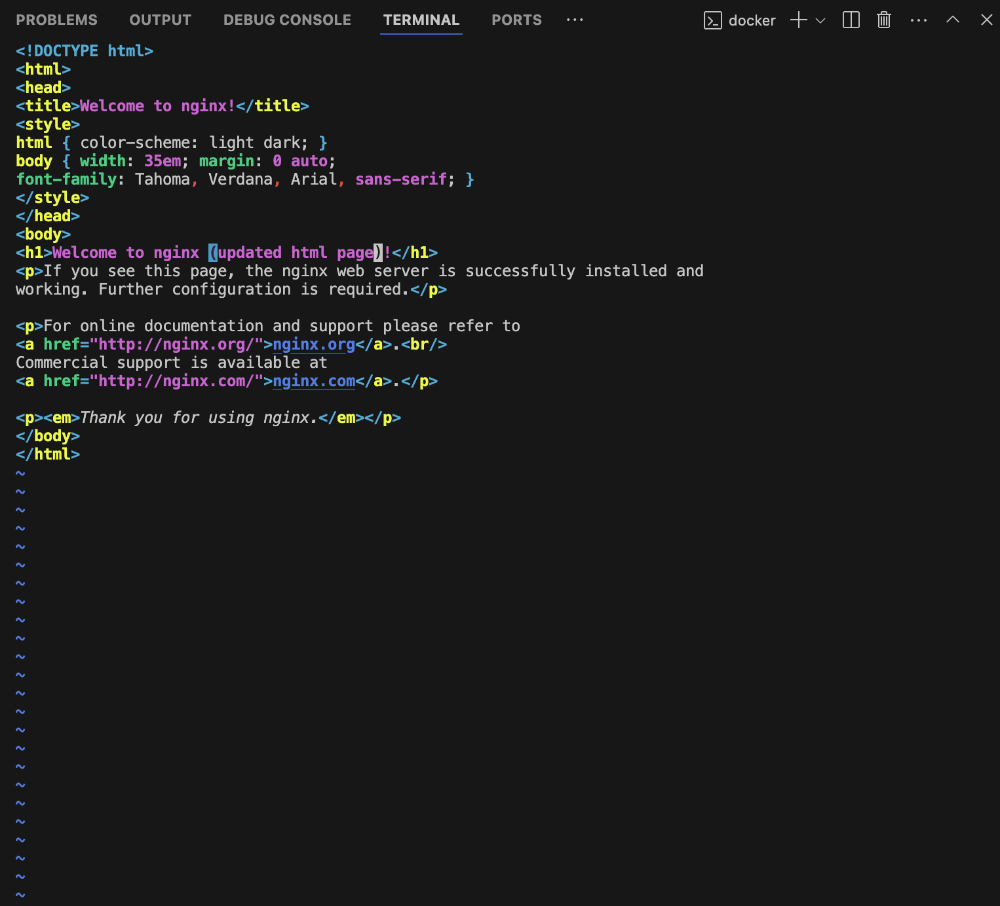
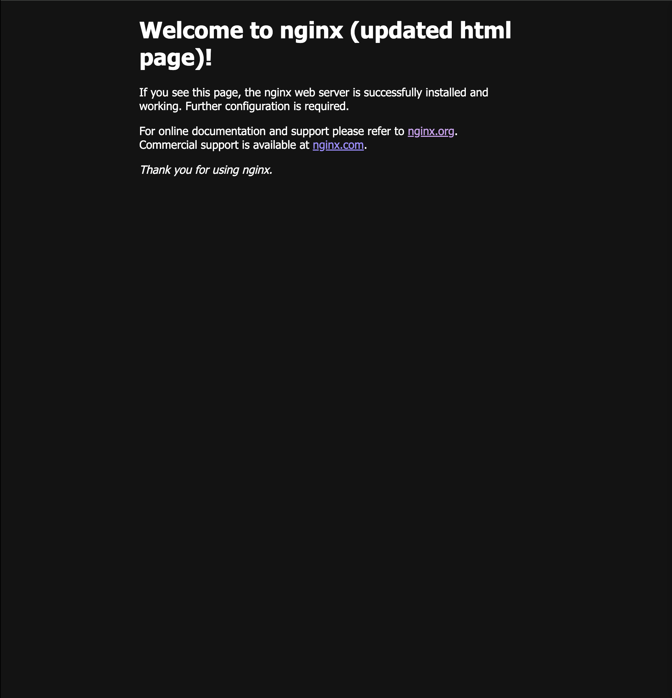

# 🛠️ Customising Nginx Web Page in a Docker Container 🐳

## 📖 Overview

By default, Nginx serves a **static HTML page** when you run a container. This guide walks through **modifying the default page inside a running Nginx container**, allowing you to **customize the displayed content**.

---

## 🚀 **Step 1: Run the Nginx Container**

First, start an **Nginx container** on **port 8080**:

```plaintext
docker run -dp 8080:80 --name web nginx

```

Once running, visit **`http://localhost:8080`** to see the default **Nginx welcome page**.



---

## 🔧 **Step 2: Access the Container & Modify HTML File**

### **1️⃣ Enter the Running Container**

Use the `docker exec` command to access the container’s shell:

```plaintext
docker exec -it web /bin/bash
```

Now, you have **terminal access** inside the running Nginx container.

### **2️⃣ Install Vim (If Not Installed)**

To modify the HTML file, we need a text editor like **Vim**:

```plaintext
apt-get update && apt install vim
```

### **3️⃣ Locate & Edit the HTML File**

The default HTML file is stored at:

```plaintext
/usr/share/nginx/html/index.html
```

Edit it using Vim:

```plaintext
vim /usr/share/nginx/html/index.html
```

Make any changes you want (e.g., modify the `<h1>` tag).



---

## 🔄 **Step 3: Restart the Nginx Container**

Exit the container shell:

```plaintext
exit
```

Then restart the container to apply the changes:

```plaintext
docker restart web
```

---

## 🌍 **Step 4: Verify Changes**

Now, when you visit **`http://localhost:8080`**, you should see your **customized page** instead of the default one.



---

## 🎯 **Key Takeaways**

✅ **Modify files inside a running container** using `docker exec`  
✅ **Use Vim to edit HTML files** directly inside the container  
✅ **Restart the container** to apply changes  
✅ **Customize Nginx to display your own content**

This is useful for **testing modifications before creating a new custom image**! 🚀🐳
