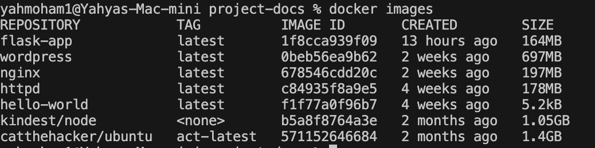

# Let's Get Started with Docker 🚀

## Step 1: List Docker Images

First, we will use the `docker images` command to list the images available in our Docker engine/daemon:

```bash
docker images
```

You will see a list of images similar to this:



---

## Step 2: Run a Container

Next, we can run a container using the `docker run` command.  
Let’s use the **hello-world** image:

```bash
docker run hello-world
```

---

### 🔍 **What happens when you run this command?**

1. **First Run:**

   - Docker checks if the **hello-world** image exists locally.
   - If it **doesn't exist**, Docker fetches the latest **hello-world** image from Docker Hub (the public registry).

2. **Subsequent Runs:**
   - Docker uses the **locally stored image**, so it won't need to fetch it again.
   - The container runs instantly without additional downloads.
