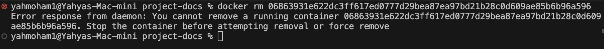

Here’s the **updated Markdown version** with the new section added and improved structure for clarity:

---

# Run Nginx Web Server in a Docker Container

Similar to our previous example, we can use Docker to run an Nginx image.

---

## Step 1: Pull the Nginx Image

First, let's pull the image using the `docker pull` command. This will pull the image from Docker Hub to our Docker daemon (Docker Desktop):

```bash
docker pull nginx
```

> **Note:** This command pulls the latest Nginx image unless we specify a particular version.

---

## Step 2: Run the Nginx Container

Once we have the image pulled, we can now run it using:

```bash
docker run nginx
```

### ⚠️ **Wait a minute—there's an issue!**

The container isn't exposed to any port.

To fix this, we can use the `-p` flag to specify the port we want to access our Nginx application on:

```bash
docker run -dp 8080:8080 --name webname nginx
```

This maps port `8080` of the host to port `8080` of the container.

---

## Step 3: Stopping the Container

To stop the running container, use the following command:

```bash
docker stop <containerID>
```

---

## Step 4: Removing the Container

To remove a container, use the following command:

```bash
docker rm <containerID>
```

> **Important:**  
> If you try to remove the container **before stopping it**, you will encounter the following error:



✅ **Best Practice:**  
Always **stop** the container first, and then **remove** it to avoid errors.

---

**Final Results**

