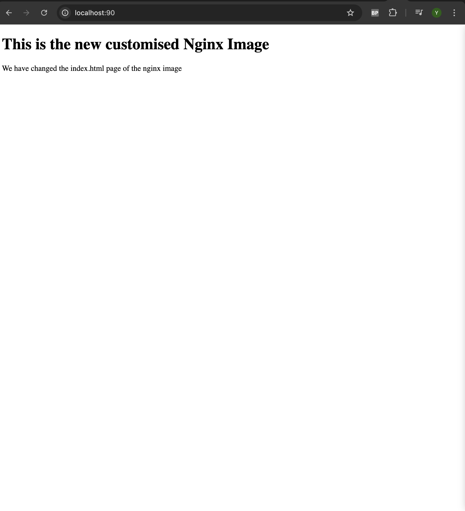

Now we will automate the process of modifying our nginx image using a dockerfile
First, lets create an index.html file and add some changes to it
Next, we can create a dockerfile to use the base image and add our new index.html file to it
Once that is done, we will build the image and tag it
docker build -t techxxx-nginx-auto:v1
once the image is built, run the container
docker run -dp 90:80 --name nginx-container techxxx-nginx-auto:v1
as you can see, we have our new index.html modified nginx page here

next, lets push this image to dockerhub
we'll first tag it using

docker tag <image-name> <your-dockerhub-username>/<repository-name>:<tag>.

and finally push your image to the repo

docker push <your-dockerhub-username>/<repository-name>

Next, lets run a container using this image on dockerhub

run the command

docker run -dp 90:80 yah3i94/new_nginx:v4

and you should see the page when accessing the contaienr at port 90

great! now as a final step, lets remove our local image (you can use the command docker rmi <image-id> or the docker desktop UI) and rerun the container, to force docker to pull the custom image from dockerhub