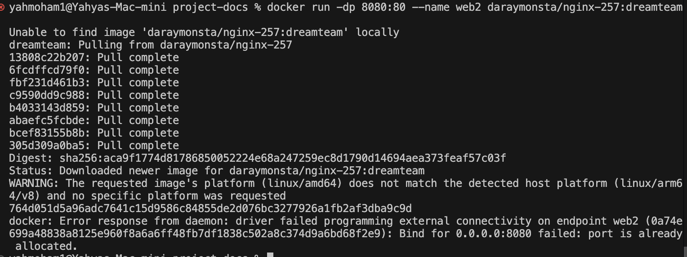

# 🐳 Running Multiple Containers Simultaneously 🚀

## 📖 Overview

When running multiple containers on the same machine, we might run into **port conflicts** if two containers try to bind to the same host port. This guide demonstrates how to **resolve port conflicts** and run multiple containers successfully.

---

## 🔥 Issue: Port Conflict

We already have an **Nginx container** running on **port 8080**, and now we want to start another container using:

```plaintext
docker run -dp 8080:80 --name web2 daraymonsta/nginx-257:dreamteam
```

### ❌ **Error: Port is Already in Use**

Since **port 8080** is already occupied by the first container, Docker **cannot bind another container** to the same port, causing a failure.



---

## ✅ **Solution: Use a Different Host Port**

### **1️⃣ Stop the Running Container (If Needed)**

To free up **port 8080**, we can stop the running container:

```plaintext
docker stop <containerID>
```

However, if we want to keep both containers running, we need to **map the new container to a different host port** instead.

---

### **2️⃣ Run the Second Container on a Different Host Port**

To avoid conflicts, we specify a different **host port (90)** while keeping the **container port (80) the same**:

```plaintext
docker run -dp 90:80 --name web2 daraymonsta/nginx-257:dreamteam
```

Now, the second container **successfully runs on port 90**, without conflicting with the first one.


---

## 🛠️ **Understanding Port Mapping (`-p host:container`)**

```plaintext
docker run -dp <host_port>:<container_port> <image_name>
```

- **Host Port** → The port on your local machine (e.g., 8080, 90).
- **Container Port** → The port inside the container that the app listens on (e.g., 80).

By changing the **host port**, we can run **multiple containers of the same image** simultaneously.

---

## 🎯 **Key Takeaways**

✅ **Always use unique host ports** when running multiple containers.
✅ **Use `docker ps`** to check which ports are already in use.
✅ **Stop containers with `docker stop <containerID>`** if needed.
✅ **Map different host ports** to run multiple instances of the same container.

---

## 🔗 **Useful Commands**

- **List running containers:**
  ```plaintext
  docker ps
  ```
- **Stop a container:**
  ```plaintext
  docker stop <containerID>
  ```
- **Remove a container:**
  ```plaintext
  docker rm <containerID>
  ```
- **Run a container on a different port:**
  ```plaintext
  docker run -dp <new_host_port>:80 --name <new_container_name> <image>
  ```

---

## 🚀 **Conclusion**

By properly managing **port assignments**, we can run **multiple containers simultaneously** without conflicts. This technique is essential when working with **microservices, load balancing, and multi-container applications** in Docker. 🐳✨

```

```
