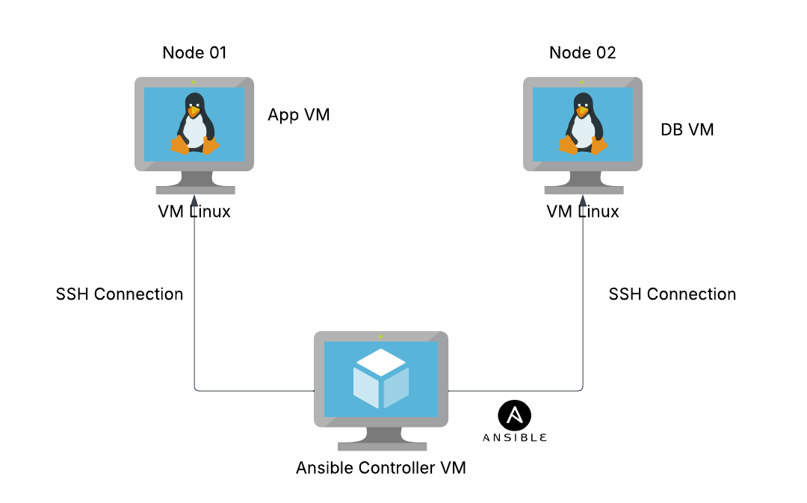

## Ansible Architecture: Two-Tier Setup

The diagram below illustrates how our Ansible setup is structured:

- We have an **Ansible Controller** running on a virtual machine (VM).
- The controller connects to and manages two **target nodes**:
  1. **Application VM** – This VM hosts the application layer.
  2. **Database VM** – This VM runs the database server.

Ansible automates the configuration and management of these nodes, ensuring a seamless deployment and maintenance process.

## How Does the Ansible Controller Determine Which Machines to Configure?

The Ansible **controller** identifies which machines to manage using an **inventory file**. This file, typically named `hosts`, is stored on the controller and contains a list of target machines (also known as managed nodes) along with their connection details.

---

## How Does the Controller Know What Actions to Perform?

The controller determines the tasks to execute in two ways:

- **Ad-hoc Commands:**  
  You can run individual commands directly on target nodes from the controller for quick actions and troubleshooting.

- **Playbooks:**  
  For more complex and structured automation tasks, Ansible uses **playbooks**. Playbooks define a sequence of tasks to be executed on managed nodes and are stored on the controller.

### Research: What Language Are Playbooks Written In and Why?

Ansible playbooks are written in **YAML (Yet Another Markup Language)**. YAML is used because:
- It is **human-readable and easy to understand**, making automation scripts more maintainable.
- It is **declarative**, allowing users to define the desired state of systems rather than specifying step-by-step procedures.
- It supports **structured data**, making it ideal for defining configurations and automation workflows.

---

## How to Modify the Ansible Controller's Settings?

The behavior and configurations of the Ansible controller can be adjusted using the `ansible.cfg` file, which is stored on the controller. This file allows customization of various settings, such as default inventory locations, logging, privilege escalation rules, and connection parameters.
